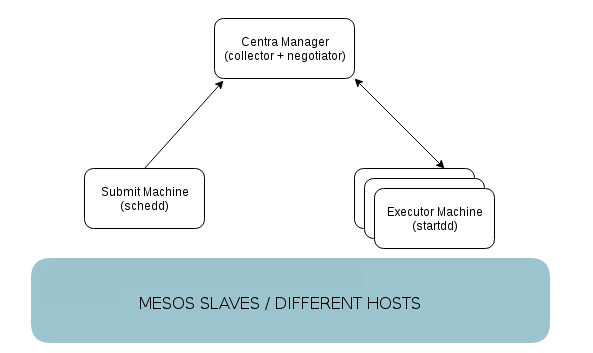

Container Docker per HTCondor
=============================

Immagine Docker HTCondor multi-role. L'immagine di base utilizzata è CentOS 7
e si fa riferimento alla versione stable di condor
(https://research.cs.wisc.edu/htcondor/yum/).

Per controllare e gestire i diversi processi lanciati nei singoli container,
si utilizza supervisord.


Architettura di riferimento
---------------------------




Come utilizzare i Dockerfile
----------------------------


### Build dell'immagine

```bash
docker build --tag dscnaf/htcondor-centos .
```


### Run dei nodi

Nodo Master:

```bash
docker run -d --name=condormaster dscnaf/htcondor-centos -m
```

Submitter:

```bash
docker run -d --name=condorsubmit dscnaf/htcondor-centos -s <MASTER_IP>
```

Lanciare un numero di nodi executor a piacere:

```bash
docker run -d --name=condorexecute dscnaf/htcondor-centos -e <MASTER_IP>
```


### LOGS

```bash
docker logs <nome_container>
```


Test applicativo
----------------

```
$ docker network create htcondor
fc246793d37dfe811203ba2ac55f3e18ebede1a559b57fe1a15d882315e59c14
$ docker run -d --name executor -h executor --net htcondor dscnaf/htcondor-centos -e master
6d7a9264079d41725f38be3e704a7d3d6b274ce99f2aa60c511b84b7c982665d
$ docker run -d --name submitter -h submitter --net htcondor dscnaf/htcondor-centos -s master
79ff820c0024213ec04fce49afeced569583e64f82d3576108573aeb0a2ffe6e
$ docker run -d --name executor -h executor --net htcondor dscnaf/htcondor-centos -e master
668873d68716bb06361b0b95f01d80117f03748c11147c48e6e0bf41201bad69
$ docker exec -it submitter /bin/bash -l
[root@submitter ~]# condor_status
Name               OpSys      Arch   State     Activity LoadAv Mem   ActvtyTime

slot1@executor     LINUX      X86_64 Unclaimed Idle      1.000 1965  0+00:00:04
slot2@executor     LINUX      X86_64 Unclaimed Idle      0.450 1965  0+00:00:35
slot3@executor     LINUX      X86_64 Unclaimed Idle      0.000 1965  0+00:00:36
slot4@executor     LINUX      X86_64 Unclaimed Idle      0.000 1965  0+00:00:37
                     Machines Owner Claimed Unclaimed Matched Preempting

        X86_64/LINUX        4     0       0         4       0          0

               Total        4     0       0         4       0          0
[root@submitter ~]# useradd -m -s /bin/bash dmr
[root@submitter ~]# su - dmr
[dmr@submitter ~]$ cat > sleep.sh <<EOF
> #!/bin/sh
> echo "Sleeping for 20 seconds..."
> sleep 20
> echo "Done"
> exit 0
> EOF
[dmr@submitter ~]$ cat > sleep.sub <<EOF
> executable = sleep.sh
> initialdir = run\$(Process)
> log = sleep.log
> output = sleep.out
>
> queue 100
> EOF
[dmr@submitter ~]$ condor_submit sleep.sub
Submitting job(s)....................................................................................................
100 job(s) submitted to cluster 2.
[dmr@submitter ~]$ condor_status
Name               OpSys      Arch   State     Activity LoadAv Mem   ActvtyTime

slot1@executor     LINUX      X86_64 Claimed   Busy      1.000 1965  0+00:00:04
slot2@executor     LINUX      X86_64 Claimed   Busy      0.030 1965  0+00:00:05
slot3@executor     LINUX      X86_64 Claimed   Busy      0.000 1965  0+00:00:06
slot4@executor     LINUX      X86_64 Claimed   Busy      0.000 1965  0+00:00:07
                     Machines Owner Claimed Unclaimed Matched Preempting

        X86_64/LINUX        4     0       4         0       0          0

               Total        4     0       4         0       0          0
[dmr@submitter ~]$ condor_q

-- Schedd: submitter : <172.18.0.3:50942?...
 ID      OWNER            SUBMITTED     RUN_TIME ST PRI SIZE CMD
   2.0   dmr             5/31 07:15   0+00:00:11 R  0   0.0  sleep.sh
   2.1   dmr             5/31 07:15   0+00:00:11 R  0   0.0  sleep.sh
   2.2   dmr             5/31 07:15   0+00:00:11 R  0   0.0  sleep.sh
   2.3   dmr             5/31 07:15   0+00:00:11 R  0   0.0  sleep.sh
[...]

100 jobs; 0 completed, 0 removed, 96 idle, 4 running, 0 held, 0 suspended
[dmr@submitter ~]$ cat run42/sleep.out
Sleeping for 20 seconds...
Done
[dmr@submitter ~]$ cat run42/sleep.log
000 (002.042.000) 05/31 07:15:11 Job submitted from host: <172.18.0.3:50942?addrs=172.18.0.3-50942>
...
001 (002.042.000) 05/31 07:18:55 Job executing on host: <172.18.0.4:59558?addrs=172.18.0.4-59558>
...
006 (002.042.000) 05/31 07:19:03 Image size of job updated: 16088
        3  -  MemoryUsage of job (MB)
        2200  -  ResidentSetSize of job (KB)
...
005 (002.042.000) 05/31 07:19:16 Job terminated.
        (1) Normal termination (return value 0)
                Usr 0 00:00:00, Sys 0 00:00:00  -  Run Remote Usage
                Usr 0 00:00:00, Sys 0 00:00:00  -  Run Local Usage
                Usr 0 00:00:00, Sys 0 00:00:00  -  Total Remote Usage
                Usr 0 00:00:00, Sys 0 00:00:00  -  Total Local Usage
        32  -  Run Bytes Sent By Job
        72  -  Run Bytes Received By Job
        32  -  Total Bytes Sent By Job
        72  -  Total Bytes Received By Job
        Partitionable Resources :    Usage  Request Allocated
           Cpus                 :                 1         1
           Disk (KB)            :        8        1  63448736
           Memory (MB)          :        3        1      1965
...
```


TBD
---

* Gestione della sicurezza
* Sistemare i log
